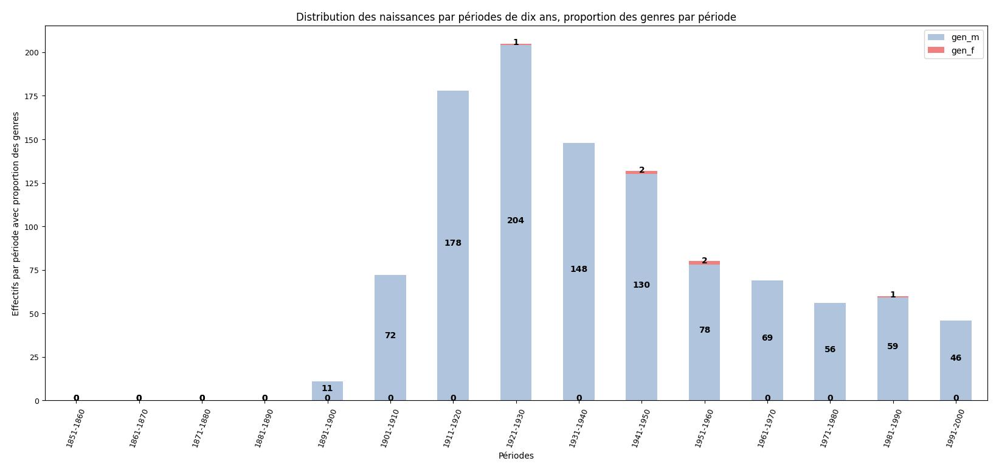
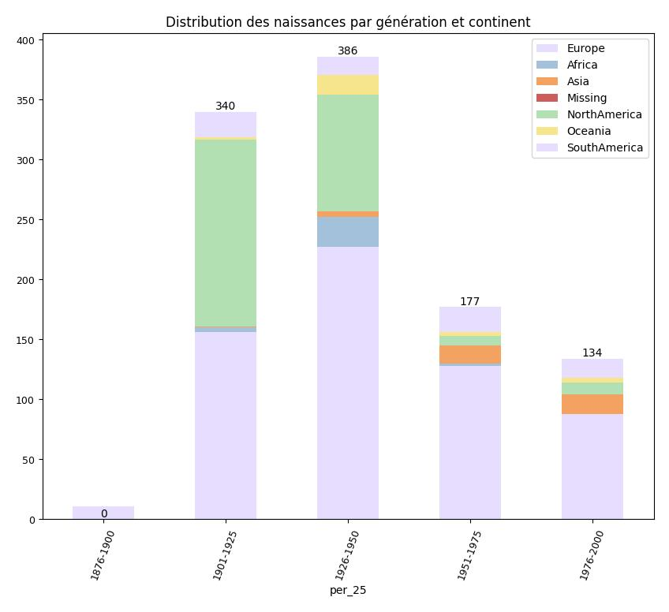

<!-- page1_distribution_temporelle.md -->

# Question 1 : Distribution des naissances dans le temps

## 1. Contexte et objectif  
Nous souhaitons analyser l’évolution annuelle du nombre de naissances issues de Wikidata.  
**Enjeu** : identifier pics, creux et périodes charnières (guerres, baby-boom, etc.).

## 2. Méthodologie de production  
- **Extraction des données** : exécuter les cellules 2 à 5 du notebook `wdt_distribution_naissances_triplestore.ipynb` (requête SPARQL et chargement dans un DataFrame).  
- **Nettoyage et filtrage** : exécuter les cellules 6 à 8 (filtre années 1800–2020, tri).  
- **Organisation** : format “année / effectif” prêt à tracer.

## 3. Graphique principal  

## 4. Interprétation  
- **Pic majeur** : autour de 1946–1964 (baby-boom).  
- **Creux** : périodes de guerre (1914–1918, 1939–1945).  
- **Tendance générale** : croissance nette après 1950, plateau depuis les années 2000.

---

<!-- page2_distribution_continents.md -->

# Question 2 : Répartition des naissances par continent

## 1. Contexte et objectif  
Objectif : visualiser la distribution géographique des naissances selon les continents.  
**Enjeu** : repérer les disparités (population vs. couverture Wikidata).

## 2. Méthodologie de production  
- **Requête et extraction** : exécuter les cellules 3 à 6 du notebook `wdt_distribution_continents_triplestore.ipynb` (récupération des effectifs par continent).  
- **Jointure géospatiale** : exécuter les cellules 7 à 9 (chargement du GeoJSON et fusion avec les comptes).  
- **Préparation** : DataFrame “continent / effectif” et GeoDataFrame prêt à tracer.

## 3. Graphiques  

### 3.1 Distribution des naissances par génération et continent

### 3.2 Carte choroplèthe  
> **À générer** : cellule 13 → exporter en `images/naissances_par_continent_map.png`.  

## 4. Interprétation  
- **Continent dominant** : Asie (> 50 %).  
- **Écarts relatifs** : Afrique sous-représentée (biais de couverture).  
- **Facteurs** : population, priorité éditoriale de Wikidata.

---

<!-- page3_spatio_temporelle.md -->

# Question 3 : Évolution spatio-temporelle des naissances

## 1. Contexte et objectif  
Étudier comment la part de chaque continent évolue au fil des années.  
**Enjeu** : voir les dynamiques relatives (rattrapage, convergence/divergence).

## 2. Méthodologie de production  
- **Extraction conjointe** : exécuter les cellules 4 à 8 de `wdt_distribution_naissances_triplestore.ipynb` modifiées pour inclure le continent.  
- **Pivot temporel** : exécuter la cellule 9 pour obtenir une table “année × continent”.  
- **Préparation des small multiples** : cellules 10 à 12 pour tracer un graphique par continent (ou créer une animation).

## 3. Illustrations  

> **À générer** :  
> - Cellules 11–14 → exporter en `images/spatio_Afrique.png`, `images/spatio_Asie.png`, etc.  
> - (Optionnel) animation GIF via cellule 15.

  
  
*(… autres continents …)*

## 4. Interprétation  
- **Points de bascule** : années où l’Afrique dépasse l’Europe (ex. 1980).  
- **Trajectoires** : croissance plus rapide en Asie et Afrique 1950–2000.  
- **Limites** : biais de complétude, décalage d’enregistrement.

---
