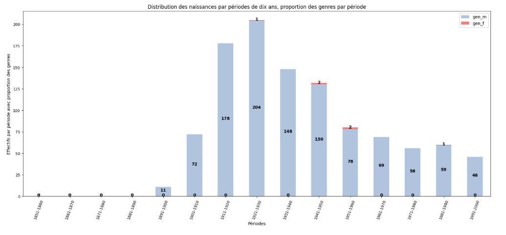
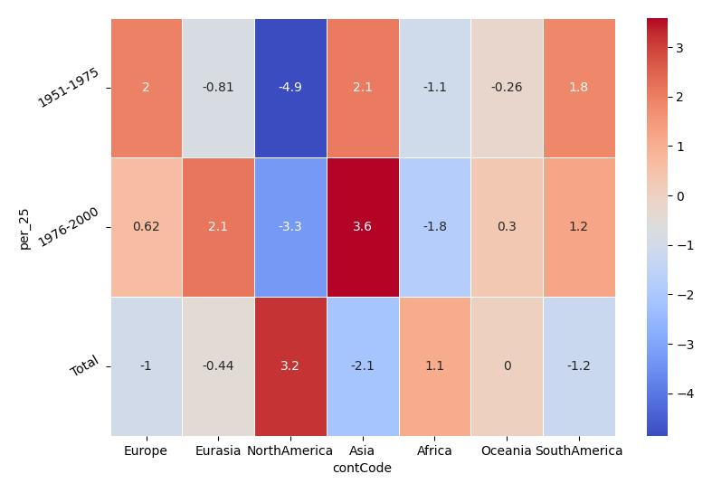
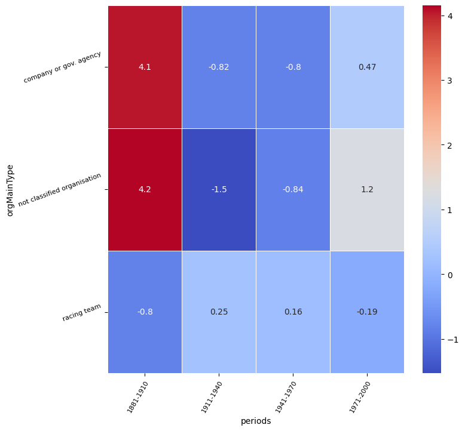
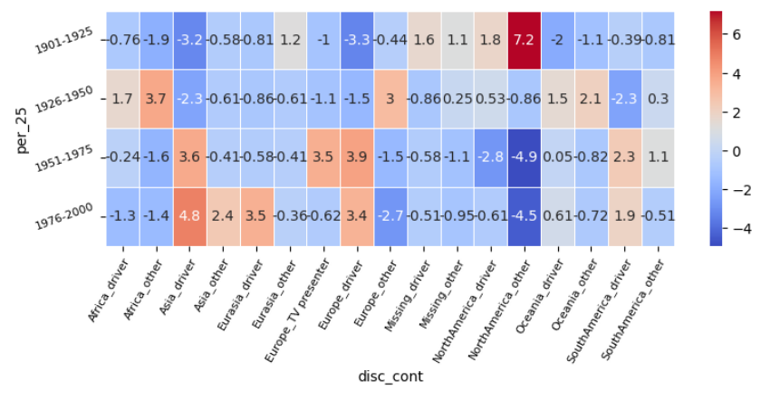

<!-- page1_distribution_temporelle.md -->

# Question 1 : Distribution des naissances dans le temps

## 1. Contexte et objectif  
Nous souhaitons analyser l’évolution annuelle du nombre de naissances issues de Wikidata.  
**Enjeu** : identifier pics, creux et périodes charnières (guerres, baby-boom, etc.).

## 2. Méthodologie de production  
- **Extraction des données** : exécuter les cellules 2 à 5 du notebook `wdt_distribution_naissances_triplestore.ipynb` (requête SPARQL et chargement dans un DataFrame).  
- **Nettoyage et filtrage** : exécuter les cellules 6 à 8 (filtre années 1800–2020, tri).  
- **Organisation** : format “année / effectif” prêt à tracer.

## 3. Graphique principal  

## 4. Interprétation  
- **Pic majeur** : autour de 1911–1940 (baby-boom).   
- **Tendance générale** :  plateau depuis les années 1970.

---

<!-- page2_distribution_continents.md -->

# Question 2 : Répartition des naissances par continent

## 1. Contexte et objectif  
Objectif : visualiser la distribution géographique des naissances selon les continents.  
**Enjeu** : repérer les disparités (population vs. couverture Wikidata).

## 2. Méthodologie de production  
- **Requête et extraction** : exécuter les cellules 3 à 6 du notebook `wdt_distribution_continents_triplestore.ipynb` (récupération des effectifs par continent).  
- **Jointure géospatiale** : exécuter les cellules 7 à 9 (chargement du GeoJSON et fusion avec les comptes).  
- **Préparation** : DataFrame “continent / effectif” et GeoDataFrame prêt à tracer.

## 3. Graphiques  

### 3.1 Distribution des naissances par génération et continent

## 4. Interprétation  
- **Continent dominant** : Europe.  
- **Écarts relatifs** : Afrique sous-représentée.  
- **Facteurs** : population, priorité éditoriale de Wikidata.

---

<!-- page3_spatio_temporelle.md -->

# Question 3 : Évolution spatio-temporelle des naissances

## 1. Contexte et objectif  
Étudier comment la part de chaque continent évolue au fil des années.  
**Enjeu** : voir les dynamiques relatives (rattrapage, convergence/divergence).

## 2. Méthodologie de production  
- **Extraction conjointe** : exécuter les cellules 4 à 8 de `wdt_distribution_naissances_triplestore.ipynb` modifiées pour inclure le continent.  
- **Pivot temporel** : exécuter la cellule 9 pour obtenir une table “année × continent”.  
- **Préparation des small multiples** : cellules 10 à 12 pour tracer un graphique par continent (ou créer une animation).

## 3. Illustration  

## 4. Interprétation  
- **Points de bascule** : années où l’Afrique dépasse l’Europe (ex. 1980).  
- **Trajectoires** : croissance plus rapide en Asie et Afrique 1950–2000.  
- **Limites** : biais de complétude, décalage d’enregistrement.

---

# Question 4 : Types d'organisations associées aux pilotes de F1 selon les périodes

## 1. Contexte et objectif

Analyser l'évolution des types d’organisations (employeurs, équipes, sponsors) associées aux pilotes de Formule 1 selon les périodes historiques.

**Enjeu** : comprendre la professionnalisation du sport automobile et l'évolution de ses acteurs institutionnels.

## 2. Méthodologie de production

- **Données** : issue de Wikidata via SPARQL, extraction des entités liées aux pilotes.
- **Regroupement temporel** : les périodes ont été regroupées en grands intervalles (1881–1910, 1911–1940, etc.).
- **Classification** : typologie des organisations ("racing team", "company or gov. agency", etc.).
- **Analyse** : tableau de contingence croisée, test du chi², puis visualisation des résidus standardisés via une heatmap.

## 3. Illustration

## 4. Interprétation

Cette carte de chaleur montre l'écart à l'indépendance statistique entre types d'organisations et périodes historiques (résidus du test du chi²).

### Période 1881–1910 :
- Forte **surreprésentation** de "company or gov. agency" et de "not classified organisation".
- 🧐 Hypothèse : à cette époque, les courses automobiles étaient principalement organisées par des industriels, clubs ou entités d'État. Les écuries n'étaient pas encore structurées.

### 1911–1970 :
- Légère **sous-représentation** des entreprises/gouvernements.
- Montée progressive des "racing teams".
- 💡 Apparition d'équipes semi-professionnelles, mais hétérogénéité importante.

### 1971–2000 :
- Réduction des écarts : les catégories se rapprochent de l’indépendance.
- Légère reprise des "not classified organisations".
- 🤔 Peut révéler la présence d'entités non nommées ou de sponsors peu documentés.

### Bilan
- Le graphique illustre la **professionnalisation progressive** de la F1.
- Le rôle dominant des "racing teams" s’affirme après 1940, avec un déclin des entités non classifiées.
- Les premières décennies sont marquées par une organisation plus institutionnelle ou artisanale.

## 5. Limites

- Certains résultats peuvent être biaisés par la complétude variable des données Wikidata.
- La catégorisation "not classified" peut masquer une grande variété de cas réels.

# Question 5 : Profils géoculturels et métiers des personnalités liées à la F1 selon les périodes

## 1. Contexte et objectif
Explorer les liens entre le **continent d'origine** et les **profils professionnels** (pilotes, médias, autres) des personnalités associées à la Formule 1, selon les grandes périodes du XXe siècle.

**Enjeu** : comprendre la construction géoculturelle du sport automobile mondial, ses dynamiques de représentation et ses biais.

## 2. Méthodologie de production
- **Classification croisée** : croisement des professions avec les continents d'origine dans une variable composite `disc_cont` (ex. `Europe_driver`).
- **Périodes** : regroupement par quart de siècle (`1901–1925`, `1926–1950`, etc.).
- **Test du chi²** sur la table de contingence puis visualisation des **résidus standardisés** sous forme de heatmap.

## 3. Illustration

## 4. Interprétation
La carte de chaleur met en évidence les profils professionnels et continentaux **sur- ou sous-représentés** par période.

### 1901–1925 :
- Forte surreprésentation de **NorthAmerica_other** (+7.2)
- Sous-représentation des métiers liés à la course automobile en dehors de l'Europe
- 🧐 Période pionnière, où les profils techniques ou industriels américains jouent un rôle fort

### 1926–1950 :
- Pic de **Africa_other** (+3.7) et **Europe_driver** (+3.0)
- Recul de **Asia_other** (–2.3)
- 💡 Affirmation européenne du sport auto ; premiers pilotes africains ?

### 1951–1975 :
- Forte **surreprésentation des Europe_driver** (+3.9)
- ❌ Forte **sous-représentation de NorthAmerica_other** (–4.9)
- 📊 Période d’hégémonie européenne dans la F1 naissante

### 1976–2000 :
- Montée de **Asia_driver** (+4.8) et **Europe_other** (+3.5)
- Continuité de la sous-représentation nord-américaine non sportive (–4.5)
- 🤝 Tendance à la diversification géographique des profils dans la sphère F1

## 5. Bilan
- Le graphique révèle une évolution des **dynamiques géoculturelles** dans l'entourage de la F1.
- Une **domination européenne persistante** mais remise en question par la montée de profils asiatiques ou africains.
- Mise en évidence d’une **sous-représentation américaine** hors domaine sportif.

## 6. Limites
- Catégories professionnelles simplifiées ("driver", "other", etc.).
- Le regroupement continental peut masquer des dynamiques nationales.
- Les données peuvent être incomplètes ou biaisées selon la disponibilité Wikidata.

---
# Question 6 : Nombre d'équipes par pilote et de pilotes par équipe

## 1. Contexte et objectif

Explorer la structure relationnelle du sport automobile en analysant :
- combien d'équipes un pilote a connues,
- combien de pilotes une équipe a accueillis.

**Enjeu** : détecter les dynamiques de fidélité, de rotation ou de longévité des carrières et des écuries dans l’univers de la Formule 1.

## 2. Méthodologie de production

- **Requête SPARQL** : extraction depuis Wikidata de tous les liens directs entre pilotes et équipes (propriété `wdt:P54`).
- **Construction d’un graphe biparti** : nœuds de type `pilote` et `équipe`, liés s’ils ont été associés.
- **Analyse des degrés** :
  - Degré d’un pilote = nombre d’équipes associées.
  - Degré d’une équipe = nombre de pilotes enregistrés.
- **Mesures produites** :
  - Moyenne des degrés.
  - Classements des pilotes et équipes les plus connectés.

## 3. Résultats

### Moyenne des degrés

- **Pilotes** : chaque pilote a couru pour environ **2.42** équipes en moyenne.
- **Équipes** : chaque équipe a eu en moyenne **2.87** pilotes.

### Équipes avec le plus de pilotes :
Williams Racing: 23 pilotes
Scuderia Ferrari: 23 pilotes
Alfa Romeo Racing: 23 pilotes
McLaren: 20 pilotes
Team Lotus: 19 pilotes
British Racing Motors: 15 pilotes
Cooper Car Company: 13 pilotes
Renault F1 Team: 11 pilotes
Scuderia Centro Sud: 10 pilotes
Brabham: 10 pilotes

### Pilotes avec le plus d'équipes :
:   13 équipes
Denny Hulme: 9 équipes
Henri Pescarolo: 8 équipes
Graham Hill: 7 équipes
Bruno Giacomelli: 7 équipes
Arturo Merzario: 7 équipes
John Surtees: 7 équipes
Jacky Ickx: 6 équipes
Roy Salvadori: 6 équipes
Keke Rosberg: 6 équipes

## 4. Interprétation

- Plusieurs équipes affichent un nombre similaire de pilotes (~23), ce qui reflète à la fois leur longévité sportive et une bonne complétude des données Wikidata.
- La présence en tête d’**Alfa Romeo Racing** peut surprendre, mais s’explique probablement par le regroupement d'entités historiques sous ce nom dans Wikidata.
- Des équipes historiques comme **Team Lotus** ou **BRM** confirment leur rôle dans les décennies passées, malgré leur disparition aujourd’hui.
- Les écuries modernes peuvent apparaître plus bas du fait de leur stabilité ou d’une carrière longue de certains pilotes (ex. Hamilton chez Mercedes).
- La majorité des pilotes ont couru pour **2 à 3 équipes**, tandis que peu dépassent les 5.

## 5. Limites

- **Variation de nom** : certaines équipes changent de nom ou de structure au fil du temps (ex. Sauber → Alfa Romeo), ce qui peut fausser les comptes.
- **Fusion ou éclatement** de données : Wikidata peut regrouper ou séparer arbitrairement certaines entités.
- Les relations pilotes-équipes doivent être **explicitement renseignées** pour apparaître, ce qui crée un biais si certaines périodes sont moins documentées.

---

